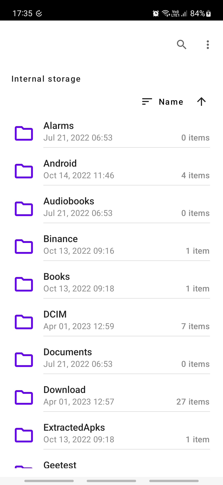
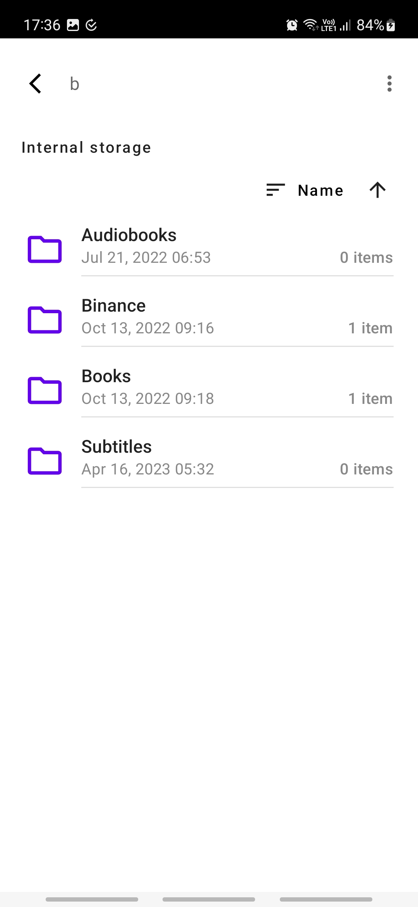
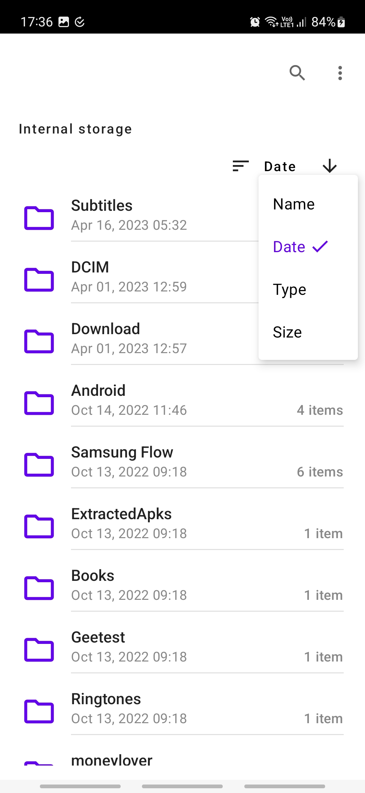
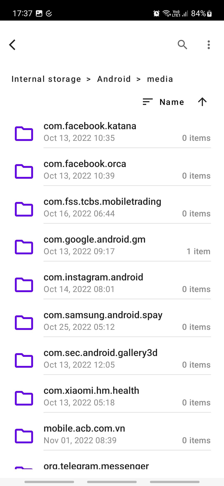

Fossil File Explorer
===========

A file explorer app that can:
* Show folders, sub-folders and files in device (certainly, not ones restricted by Android)
* Display info: current path, last modified, folder children count and file size.
* Search in current folder
* Sort ascending/descending by Name, Date, Type or Size
* Go directly to parent levels in folder tree using path
* Open files with other support apps
* Quick review image files (bmp, jpeg, png)

Technical points:
* Clean Architecture
* Jetpack Compose
* Storage permission handling

Get started
-----------

This app requires read external storage permission pre Android 11 and access all files special permission post Android 11 to work properly.

Screenshots
-----------

